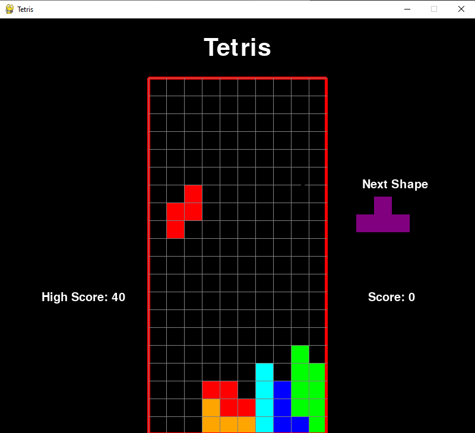

# TP2

#### :alarm_clock: [Date de remise le Dimanche 5 juin 2021 à 23h59]
## Objectif

Ce TP a pour objectif de pratiquer les fonctions et la lecture et écriture de fichiers, en plus de continuer d'approfondir vos compétences d'algorithmie.

## Critères d'évaluation

Une démarche de qualité et un bon résultat donnent la note maximale. Une erreur minime (ex faute de frappe) mènera à une pénalité de 0.5 points. Puisqu'il s'agit d'un cours de programmation, une attention particulière sera accordée à la qualité du code. La note possible maximale du TP est 100%.

Aussi, pour le 2e TP, je serai un peu plus regardant sur les algorithmes que vous utilisez pour compléter les fonctions. Faites donc attention à éviter les boucles inutiles et les fonctions trop complexes.

Un code qui ne roule pas est un 0 automatique, alors testez votre code!!

N'oubliez pas de jeter un oeil aux erreurs courantes de qualité de code dans le fichier [QualiteCode.md](./ressources/QualiteCode.md)

## Consignes à respecter

Tout d'abord, assurez-vous d'avoir lu le fichier [Instructions.md](./ressources/Instructions.md) et d'avoir téléchargé les fichiers que vous devrez compléter.

Aussi, vous ne pouvez pas importer d'autres librairies que celle qui sont déjà importées dans les fichiers. Toutes les fonctions qu'on s'attend à ce que vous complétiez sont identifiées par des `TODO`.

Finalement, tous les fichiers doivent êtres lus avec l'aide de context managers.

## Rouler le code

Pour ce TP, on aura besoin de la librairie pygame qui est utilisée pour créer des jeux. On pourra l'installer en roulant la commande

```cmd
conda install pygame
```

OU

```cmd
python -m pip install pygame
```

Veuillez noter que vous n'aurez PAS à coder quoi que ce soit qui utilise la librairie pygame, mais le code du TP l'utilise pour afficher les objets du jeu.

Le fichier de jeu principal est le fichier main.py. Cependant, il ne fonctionnera que si le fichier fonctions.py est complété. On voudra le rouler avec la commande:

```cmd
python main.py
```

 Le fichier utilisé pour rouler les tests est testsTetris.py. Une fois que vous l'aurez complété, on voudra le rouler avec la commande:

```cmd
python testTetris.py
```

## MISE EN CONTEXTE



## PARTIE 1 - FONCTIONS DU JEU

On veut programmer un jeu de Tetris! La partie 1 consiste à compléter les fonctions annotées avec un `TODO` dans le fichier `fonctions.py`. Vous pouvez utiliser les constantes définies dans le fichier consts.py pour simplifier votre code :)

### initialiserGrille()

La fonction initialiserGrille sert à créer une grille de taille HAUTEUR_GRILLE x LARGEUR_GRILLE. La fonction ne prend aucun paramètre en entrée, et retourne un tableau 2D rempli avec la valeur de COULEUR_VIDE.

### remplirGrille(positionsConfirmees)

La fonction remplirGrille sert à remplir la grille avec les couleurs des pièces déjà placées. Elle prend en entrée la liste des positionsConfirmées, qui a la forme suivante:

```JSON
[
    {
        "ligne": 19, 
        "colonne": 5, 
        "couleur": [0, 255, 0]
    }, 
    {
        "ligne": 19, 
        "colonne": 6, 
        "couleur": [255, 0, 0]
    }
]
```

La fonction retourne une grille de taille HAUTEUR_GRILLE x LARGEUR_GRILLE remplie avec la valeur de COULEUR_VIDE ou de la valeur de la couleur à chaque positionConfirmée.

### obtenirPieceAleatoire()

La fonction obtenirPieceAleatoire sert à choisir une pièce aléatoire du dictionnaire des pièces PIECES définit dans le fichier `consts.py`. On veut retourner une entrée du dictionnaire. Par exemple, si on voulait retourner la pièce en forme de I, la valeur de retour de la fonction serait:

```JSON
{
    "symbole": "i",
    "couleur": [0, 255, 255],
    "forme": [["0"],
              ["0"],
              ["0"],
              ["0"]]
    }
```

### faireTournerPiece(piece, rotation)

La fonction faireTournerPiece sert à faire tourner une pièce selon un certain nombre de rotations. Elle prend en entrée un tableau représentant la forme de la pièce et un entier allant de 0 à l'infini représentant le nombre de fois qu'on fait tourner la pièce vers la droite.

La fonction tournerTableau90Droite vous est fournie pour vous aider. Elle prend en entrée un tableau 2D et fait tourner une fois le tableau vers la droite.

Par exemple, pour l'entrée

```python
piece =  [[".", "0", "."],
          ["0", "0", "0"]]
rotation = 2
```

La valeur de retour doit être

```python
pieceTournee = [["0", "0", "0"],
                [".", "0", "."]]
```

### estPartiePerdue(positionsConfirmees)

La fonction estPartiePerdue sert à déterminer si une partie est perdue ou non. La fonction retourne `True` si la partie est perdue, et `False` sinon. La fonction prend en entrée la liste des positions confirmées, qui a la forme suivante:

```JSON
[
    {
        "ligne": 19, 
        "colonne": 5, 
        "couleur": [0, 255, 0]
    }, 
    {
        "ligne": 19, 
        "colonne": 6, 
        "couleur": [255, 0, 0]
    }
]
```

La partie est terminée si une des positions confirmées est dans la première ligne.

### enleverLignesPleines(grille, positionsConfirmees)

La fonction enleverLignesPleines est la fonction qui est appellée lorsqu'on complète une ligne. Elle prend en entrée la grille remplie avec les positions confirmées et les cases occupées par la pièce courante sous la forme d'un tableau 2D comprenant les couleurs de chaque case. On a aussi la liste des positionsConfirmées, sous la forme:

```JSON
[
    {
        "ligne": 19, 
        "colonne": 5, 
        "couleur": [0, 255, 0]
    }, 
    {
        "ligne": 19, 
        "colonne": 6, 
        "couleur": [255, 0, 0]
    }
]
```

On voudra utiliser la fonction pour mettre à jour la liste des positionsConfirmées en enlevant celles qui sont dans les lignes pleines de la grille (les lignes qui contiennent juste des couleurs).

On voudra aussi calculer les points obtenus en complétant des lignes, soit le nombre de lignes complétées * 10.

La fonction doit retourner la liste des positions confirmées mise à jour et le score

### obtenirMeilleurScore()

Cette fonction sert à retrouver le meilleur score obtenu dans la liste de tous les scores sauvegardée dans le fichier `scores.txt`. S'il n'y a aucun score, on retourne 0, sinon on retourne un entier représentant le score maximal obtenu.

### sauvegarderNouveauScore(nouveauScore)

Cette fonction prend en entrée un entier représentant le nouveau score obtenu. Si ce score est plus grand que 0, on veut le sauvegarder dans une nouvelle ligne du fichier `scores.txt`.

## PARTIE 2 - TEST DES FONCTIONS

Cette fois-ci, c'est vous qui devrez coder le fichier qui exécute les tests. Les réponses attendues de chaque fonction à tester sont dans les fichiers dans le dossier `resultatTests`. On voudra donc tester les fonctions suivantes:

- initialiserGrille
- remplirGrille
- faireTournerPiece
- estPartiePerdue
- enleverLignesPleines

Chaque fichier .json dans le dossier `resultatTests` représente une liste de tests et les résultats attendus, sous la forme suivante:

```python
{
    "tests": [
        {
            "operandes": {
                "operande1": valeur,
                "operande2": valeur
            },
            "attendu": resultatAttendu
        },
        ...
        {
            "operandes": {
                "operande1": valeur,
                "operande2": valeur
            },
            "attendu": resultatAttendu
        }
    ]
}
```

(Les clefs du dictionnaire d'opérandes ne seront pas operande1 et operande2 mais bien les noms des opérandes, par exemple "positionsConfirmees" pour la fonction estPartiePerdue)

Vous devrez donc compléter le fichier `testsTetris.py`. Complétez chaque fonction marquée d'un `TODO`, qui servira à tester votre code. Chaque fonction de test doit lire le fichier json, et pour chaque test du dictionnaire, la fonction doit exécuter votre code et comparer le résultat obtenu avec le résultat attendu. Si un seul des tests échoue, la fonction retourne `False`. Si tous les tests passent, la fonction retourne `True`.

(C'est normal qu'il y ait un peu de duplication de code dans ce fichier)

Encore une fois, le fait que tous les tests passent n'est pas une garantie que votre code est parfait, mais c'est un bon signe.

## PARTIE 3 - APPEL DES FONCTIONS DANS LA BOUCLE DE JEU

Finalement, la dernière partie de ce travail est de compléter le fichier `main.py` et d'appeller les fonctions que vous avez codées en suivant les `TODO`.

Vous n'avez qu'à appeller les fonctions demandées avec les paramètres indiqués, et votre code devrait fonctionner :)
